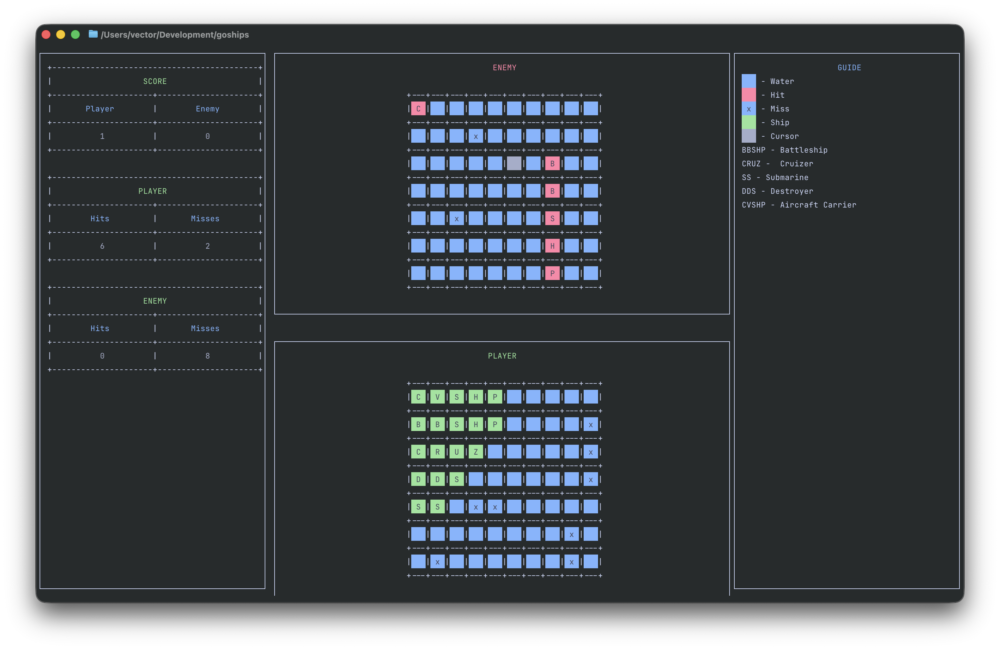

<h1 align="center">GOSHIPS</h1>
<p align="center">Battleships on the terminal</p>

<p align="center">

</p>

---

## Overview
Was too bored so built a terminal battleships game. Can play right in the terminal when bored and without internet. AI is a bit janky and not very smart.

## Features
- Terminal based
- Run on any platform with Go installed

## Controls
- `Space` rotates ships
- `Enter` to place ships and hit the cells
- `q` to quit the game
- `s` to save the state in the logs directory when in debug mode
- `up` to move ship or cursor up
- `down` to move ship or cursor down
- `left` to move ship or cursor left
- `right` to move ship or cursor right

## Gameplay Instructions
- Place your ships in the player map.
- Use your the cursor in the enemy map to move around and hit the cells.
- Every hit scores you a point and reveals the cell.

## Installation
- Prerequisites (e.g., Go version, OS support)

### Using `go install`

```bash
go install github.com/Vector-ops/goships
```

### Build from source

```bash
# Clone the repository
git clone https://github.com/Vector-ops/goships.git
cd goships

# Build the game
go build

# Move the binary to a directory in your PATH
mv goships $HOME/bin/
```

## Usage

```bash
# Start the game
goships

# Start the game in debug mode
goships --debug

# Start game in debug mode and skip the debug intro
goships --debug 0
```

## Credits
- Starex, Milton Bradley and Hasbro for the original game
